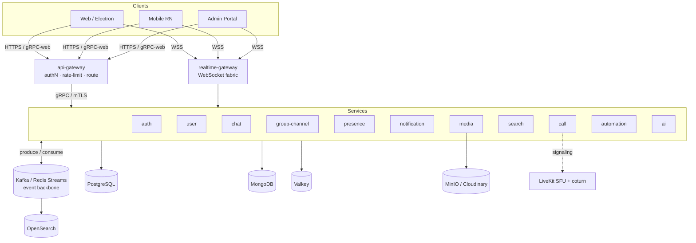

<div align="center">

# VelChat — Backend Monorepo

**A free, 100% open-source, self-hostable hybrid of WhatsApp + Microsoft Teams + Slack.**

Production-grade · multi-tenant · real-time · end-to-end encrypted (personal).

[](#-license)
[](https://nodejs.org)
[](https://pnpm.io)
[](https://www.typescriptlang.org)
[](https://nestjs.com)
[](https://www.conventionalcommits.org)

[Architecture](docs/VelChat-Architecture.md) · [Codebase Guide](docs/VelChat-Codebase-Guide.md) · [API Reference](docs/API-ENDPOINTS.md) · [Onboarding](docs/ONBOARDING.md)

</div>

---

## What is VelChat?

VelChat is one platform that serves **three usage modes on top of one identity and one messaging core** — with **no paid SaaS anywhere in the critical path**. Every component is OSS and self-hostable at zero license cost.

| Mode           | Inspired by     | Primary unit         | Encryption                                           |
| -------------- | --------------- | -------------------- | ---------------------------------------------------- |
| **Personal**   | WhatsApp        | Phone-number contact | **E2EE** (Signal) — server sees only ciphertext      |
| **Enterprise** | Microsoft Teams | Org → Team → Channel | Server-readable by design (search, compliance, bots) |
| **Workspace**  | Slack           | Workspace → Channel  | Server-readable by design                            |

A single account can live in the personal graph **and** many orgs/workspaces at once. The messaging substrate (delivery, receipts, presence, media, calls) is shared; the policy layer on top (encryption mode, retention, admin controls) differs per context.

> **The E2EE boundary is sacred.** Personal chats, calls, status, media, translation, search, and AI run so the server **never** sees plaintext. Enterprise content is server-readable _by design_. No code path ever leaks personal plaintext to the server.

> **Scope:** this is the **backend** monorepo. The `clients/` track (web / mobile / desktop / admin) lives in a separate repository and is intentionally out of scope here.

---

## Highlights

- **13 stateless microservices**, event-driven core — every state change emits a Kafka/stream event (at-least-once + idempotency, per-conversation ordering via `seq`).
- **Polyglot persistence by access pattern** — PostgreSQL, MongoDB, Valkey, OpenSearch, MinIO/Cloudinary.
- **DAPT auth** — device-key + passkey trust loop, ₹0 cold-start via Reverse-OTP, device-bound (DPoP) rotating tokens. Identity = immutable `account_id`; phone/email are re-verifiable attributes.
- **Signal-protocol E2EE** — X3DH + Double Ratchet (1:1), Sender Keys with epoch rotation (groups), decryption-failure resend protocol (§G1).
- **Real-time gateway** — WebSocket fabric with a Valkey connection registry, cross-pod delivery, backpressure, reconnect-with-cursor (no message loss), typing fan-out.
- **Calls & meetings** — LiveKit SFU + coturn signaling, lobby, screen-share remote control.
- **Multi-tenant isolation** — Postgres RLS + fail-closed tenant context + tenant-aware repositories (§G6 defense-in-depth).
- **Observability by construction** — OpenTelemetry traces, Prometheus RED metrics, structured logs (no PII / no message content).

See the [full feature catalog](docs/VelChat-Architecture.md#a4-complete-feature-catalog) (§A4).

---

## Architecture at a glance



**Two physical planes:** the **data/control plane** (request/response + events, everything above the broker) and the **media plane** (WebRTC audio/video, peer→TURN→SFU — never touches the broker; only signaling flows through services).

---

## Monorepo layout

```text
apps/                         # 13 deployable services (NestJS)
  api-gateway/                #  TLS, authN, rate-limit, reverse-proxy routing, CORS
  realtime-gateway/           #  WebSocket fabric: presence, typing, delivery, receipts
  auth-service/               #  DAPT, Reverse-OTP, passkeys, tokens, E2EE key directory
  user-service/               #  profiles, contacts, orgs/workspaces/teams, RBAC, discovery
  chat-service/               #  messages, receipts, reactions, edits, pins, polls, resend
  group-channel-service/      #  conversations, membership, channels, communities
  presence-service/           #  online/last-seen (+ privacy), rich status, stories
  notification-service/       #  push (APNs/FCM/WebPush), prefs, DND, outbox+DLQ, digests
  media-service/              #  upload, dedup, gallery, view-once, transcode write-back, backup
  search-service/             #  OpenSearch indexing + ACL-scoped query (messages/files/people)
  call-service/               #  LiveKit signaling, meetings, lobby, screen-control
  automation-service/         #  bots, slash commands, workflows, reminders, lists/clips/canvas
  ai-service/                 #  translation (NLLB), language prefs (self-hosted models)
libs/                         # shared building blocks (no per-service copies)
  common/                     #  logging, tracing, bootstrap, tenant context, errors, event envelope
  config/                     #  env schema (zod) + typed AppConfig
  crypto/                     #  libsignal wrappers, OPRF contact discovery
  database/                   #  Postgres (RLS) + Mongo clients (Drizzle schema)
  cache/                      #  Valkey client + rate limiter
  event-bus/                  #  Kafka / Redis-Streams abstraction
  storage/                    #  MinIO / Cloudinary object storage port
  mail/  push/  search/       #  SMTP templates · push transports · search adapters
  proto/  shared-types/       #  gRPC contracts (buf) + generated TS types
migrations/                   # @velchat/migrations — versioned SQL + forward-only runner (expand/contract)
docker/                       # per-service Dockerfiles + compose.yml (local data tier)
deploy/                       # helm/ · argocd/ · k8s/  (GitOps self-host path; no secrets)
infra/                        # terraform/ · observability/
tools/                        # service scaffold generator + local dev gateway (start-all)
postman/                      # API collection
docs/                         # architecture (source of truth), codebase guide, API reference
render.yaml                   # Render Blueprint (free-tier deploy)
```

---

## Services

| Service                   | Port | Responsibility                                             | Primary store               |
| ------------------------- | :--: | ---------------------------------------------------------- | --------------------------- |
| **api-gateway**           | 3000 | TLS, verify JWT, rate-limit, reverse-proxy routing, CORS   | —                           |
| **realtime-gateway**      | 3001 | WebSocket connections, event delivery, typing, receipts    | Valkey                      |
| **auth-service**          | 3002 | DAPT, Reverse-OTP, passkeys, tokens, E2EE prekeys          | Postgres + Valkey           |
| **user-service**          | 3003 | Profiles, contacts, orgs/workspaces/teams, RBAC, discovery | Postgres                    |
| **chat-service**          | 3004 | Messages, receipts, reactions, edits, pins, polls          | MongoDB + Valkey            |
| **group-channel-service** | 3005 | Conversations, membership, channels, communities           | Postgres                    |
| **presence-service**      | 3006 | Online/last-seen (+ privacy), rich status, stories         | Valkey + Postgres           |
| **notification-service**  | 3007 | Push routing, prefs, DND, outbox + DLQ                     | Postgres + Valkey           |
| **media-service**         | 3008 | Upload, dedup, gallery, view-once, backup                  | MinIO/Cloudinary + Postgres |
| **search-service**        | 3009 | Index + ACL-scoped query (messages/files/people/channels)  | OpenSearch                  |
| **call-service**          | 3010 | LiveKit signaling, meetings, lobby, screen-control         | Postgres + Valkey           |
| **automation-service**    | 3011 | Bots, slash commands, workflows, reminders, collab         | Postgres + Valkey           |
| **ai-service**            | 3012 | Translation, language prefs (self-hosted models)           | Postgres                    |

Every service exposes `GET /health`, `GET /ready`, `GET /metrics` (Prometheus), and Swagger at `GET /docs`. A unified dev gateway aggregates all services (and their docs) at **http://localhost:8080**.

---

## Tech stack (all free / OSS / self-hostable)

| Layer              | Technology                                               |
| ------------------ | -------------------------------------------------------- |
| Language / runtime | TypeScript (strict), Node.js ≥ 20.11                     |
| Framework          | NestJS 10, gRPC + Protocol Buffers (buf)                 |
| Monorepo           | pnpm workspaces + Turborepo                              |
| Eventing           | Apache Kafka (KRaft) — or Redis Streams / NATS JetStream |
| Datastores         | PostgreSQL (Drizzle), MongoDB, Valkey, OpenSearch, MinIO |
| Real-time media    | LiveKit (SFU) + coturn (STUN/TURN)                       |
| E2EE               | libsignal (Signal protocol)                              |
| Auth / SSO         | DAPT + Keycloak (OIDC/SAML)                              |
| AI / translation   | Whisper, NLLB/Marian, Piper (self-hosted)                |
| Observability      | OpenTelemetry, Prometheus, Grafana, Loki, Tempo          |
| Orchestration      | Kubernetes / k3s, Helm, ArgoCD                           |

Full mapping with licenses: [Architecture §D1](docs/VelChat-Architecture.md#d1-free--open-source-tech-stack-final).

---

## Quick start

### Prerequisites

- **Node.js ≥ 20.11** and **pnpm ≥ 9** (`corepack enable` picks up `pnpm@9.15.0`)
- **Docker + Docker Compose** (for the local data tier) — or bring your own managed Postgres/Mongo/Valkey/OpenSearch/S3
- **[`buf`](https://buf.build)** (only if you regenerate proto)

### 1. Install & build

```bash
pnpm install
pnpm build
```

### 2. Configure

```bash
cp .env.example .env          # root defaults; each service also has apps/<svc>/.env.example
# edit .env — connection strings / secrets (never commit real secrets)
```

### 3. Bring up the data tier

```bash
pnpm infra:up                 # postgres, mongo, valkey, kafka (KRaft), opensearch, minio
pnpm db:migrate               # run versioned SQL migrations (forward-only)
```

### 4. Run

```bash
pnpm dev                      # all services in parallel (Turborepo)
# — or a single service —
pnpm dev:chat                 # dev:auth, dev:user, dev:media, ... one per service
```

### 5. Explore

- Unified API docs (Swagger): **http://localhost:8080/docs**
- Per-service: `http://localhost:<port>/docs` · health `/health` · readiness `/ready` · metrics `/metrics`

> **Boot is resilient:** if a datastore is unreachable, a service logs it once and still serves `/health` — it flips `/ready` green when every dependency pings. Connections use bounded timeouts, so a missing dependency **fails fast instead of hanging**.

---

## Testing & quality gates

```bash
pnpm lint            # eslint across the workspace
pnpm typecheck       # tsc --noEmit (strict, noUncheckedIndexedAccess)
pnpm test            # unit tests (Turborepo)
pnpm test:int        # integration tests (testcontainers)
pnpm format:check    # prettier
```

**Definition of Done** (enforced): builds · lints · types · tests green; migrations are expand/contract; proto/docs updated; traces + metrics added; the [§D4 threat model](docs/VelChat-Architecture.md#d4-threat-model-every-situational-case-covered) checklist passes; **no secret in code or images**.

Commits follow **Conventional Commits** (commitlint + husky). Versioning is per-package via **Changesets** — run `pnpm changeset` before pushing a user-facing change.

---

## Security & the E2EE boundary

- **Identity = immutable `account_id` (UUIDv7).** Never key data on a phone number.
- **DAPT** — device-key + passkey trust loop; Reverse-OTP for ₹0 cold start; server-SMS only as a rare fallback. Tokens are device-bound (DPoP) with rotating refresh + reuse detection.
- **E2EE is sacred** — no server path (chat, call, status, media, translation, search, AI) may ever observe personal plaintext. Enterprise content is server-readable _by design_.
- **Multi-tenant isolation** — Postgres RLS + fail-closed tenant context + tenant-aware repositories; authorize-not-just-filter (§G6).
- **Hardening** — mTLS between services, parameterized queries, input validation, rate limiting + attestation on auth, AV scan on uploads, append-only audit log.

Threat coverage: [Architecture §D4](docs/VelChat-Architecture.md#d4-threat-model-every-situational-case-covered).

---

## Deployment

- **Local / small:** `docker/compose.yml` for the data tier + `pnpm dev` (or the per-service Dockerfiles in `docker/`).
- **Free-tier cloud:** `render.yaml` — a Render Blueprint that provisions the services with env wiring.
- **Production:** Kubernetes / k3s via Helm + ArgoCD (GitOps) — manifests in `deploy/`. Stateless services scale on HPA (RPS / connections / consumer lag); StatefulSets run via operators (CloudNativePG, Mongo, Valkey, Kafka/Strimzi, OpenSearch, MinIO). mTLS via Linkerd; secrets via Vault / Sealed Secrets; TLS via cert-manager + Let's Encrypt.

Details: [Architecture §A21–A22](docs/VelChat-Architecture.md#a21-kubernetes-deployment-topology).

---

## Design notes

- **Drizzle, not Prisma, for Postgres.** SQL-first with no engine/codegen daemon — schema is TypeScript→SQL and migrations are real reviewable SQL files, which makes the §G7 expand/contract discipline explicit. Per-transaction RLS is trivial: `set_config('app.tenant', $1, true)` runs as raw SQL inside the same transaction — exactly what the §G6 tenant guardrail needs, and PgBouncer-friendly (Prisma's pooled engine makes per-tx GUC awkward).
- **One service owns each table/collection.** No cross-service DB reads — data crosses contexts only via gRPC or event projections (§A10.5).
- **Hot paths stay minimal.** Send-message validates → assigns `seq` → persists → emits, then returns; fan-out/notify/index happen asynchronously off the event (§B4.2).

---

## Documentation

| Doc                                                                   | What it covers                                                |
| --------------------------------------------------------------------- | ------------------------------------------------------------- |
| [VelChat-Architecture.md](docs/VelChat-Architecture.md)               | **Source of truth** — HLD + LLD, flows, threat model, roadmap |
| [VelChat-Codebase-Guide.md](docs/VelChat-Codebase-Guide.md)           | Every service, folder, and file with graphs + rationale       |
| [API-ENDPOINTS.md](docs/API-ENDPOINTS.md)                             | Full REST endpoint reference for all 13 services              |
| [INTEGRATIONS.md](docs/INTEGRATIONS.md)                               | External integrations & env wiring                            |
| [ONBOARDING.md](docs/ONBOARDING.md)                                   | New-contributor setup & workflow                              |
| [PRODUCTION-READINESS-REPORT.md](docs/PRODUCTION-READINESS-REPORT.md) | Pre-production hardening review                               |

---

## Contributing

1. Branch off `dev` (short-lived feature branches).
2. Match the task to a subagent role in `.claude/agents/`; stay within the architecture doc.
3. Ask before adding a dependency or breaking a contract.
4. `pnpm lint && pnpm typecheck && pnpm test` green + `pnpm changeset` before you push.
5. Conventional Commit messages; open a PR into `main` with a green CI.

---

## License

**AGPL-3.0-or-later** — VelChat is free to self-host at zero license cost. All dependencies are free/OSS and self-hostable (see [§D1](docs/VelChat-Architecture.md#d1-free--open-source-tech-stack-final)). Bundled components retain their own OSS licenses.

<div align="center">

**Built to be free.** No paid SaaS in the critical path — ever.

</div>
