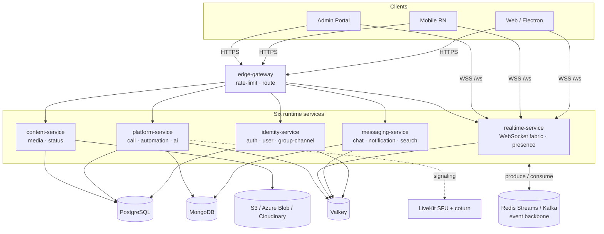

<div align="center">

# VelChat — Backend Monorepo

**A free, 100% open-source, self-hostable hybrid of WhatsApp + Microsoft Teams + Slack.**

Production-grade · multi-tenant · real-time · end-to-end encrypted (personal).

[](#-license)
[](https://nodejs.org)
[](https://pnpm.io)
[](https://www.typescriptlang.org)
[](https://nestjs.com)
[](https://www.conventionalcommits.org)

[](https://github.com/Aayushajs/VELCHAT-BACKEND/actions/workflows/ci.yml)
[](https://github.com/Aayushajs/VELCHAT-BACKEND/actions/workflows/release.yml)
[](https://github.com/Aayushajs/VELCHAT-BACKEND/releases/latest)
[](https://github.com/Aayushajs?tab=packages&repo_name=VELCHAT-BACKEND)
[](https://docs.sigstore.dev/cosign/overview/)

[Architecture](docs/VelChat-Architecture.md) · [Codebase Guide](docs/Offical-Docs/VelChat-Codebase-Guide.md) · [API Reference](docs/API-ENDPOINTS.md) · [Onboarding](docs/ONBOARDING.md)

</div>

---

## What is VelChat?

VelChat is one platform that serves **three usage modes on top of one identity and one messaging core** — with **no paid SaaS anywhere in the critical path**. Every component is OSS and self-hostable at zero license cost.

| Mode           | Inspired by     | Primary unit         | Encryption                                           |
| -------------- | --------------- | -------------------- | ---------------------------------------------------- |
| **Personal**   | WhatsApp        | Phone-number contact | **E2EE** (Signal) — server sees only ciphertext      |
| **Enterprise** | Microsoft Teams | Org → Team → Channel | Server-readable by design (search, compliance, bots) |
| **Workspace**  | Slack           | Workspace → Channel  | Server-readable by design                            |

A single account can live in the personal graph **and** many orgs/workspaces at once. The messaging substrate (delivery, receipts, presence, media, calls) is shared; the policy layer on top (encryption mode, retention, admin controls) differs per context.

> **The E2EE boundary is sacred.** Personal chats, calls, status, media, translation, search, and AI run so the server **never** sees plaintext. Enterprise content is server-readable _by design_. No code path ever leaks personal plaintext to the server.

> **Scope:** this is the **backend** monorepo. The `clients/` track (web / mobile / desktop / admin) lives in a separate repository and is intentionally out of scope here.

---

## Highlights

- **13 stateless microservices**, event-driven core — every state change emits a Kafka/stream event (at-least-once + idempotency, per-conversation ordering via `seq`).
- **Polyglot persistence by access pattern** — PostgreSQL, MongoDB, Valkey, OpenSearch, MinIO/Cloudinary.
- **DAPT auth** — device-key + passkey trust loop, ₹0 cold-start via Reverse-OTP, device-bound (DPoP) rotating tokens. Identity = immutable `account_id`; phone/email are re-verifiable attributes.
- **Signal-protocol E2EE** — X3DH + Double Ratchet (1:1), Sender Keys with epoch rotation (groups), decryption-failure resend protocol (§G1).
- **Real-time gateway** — WebSocket fabric with a Valkey connection registry, cross-pod delivery, backpressure, reconnect-with-cursor (no message loss), typing fan-out.
- **Calls & meetings** — LiveKit SFU + coturn signaling, lobby, screen-share remote control.
- **Multi-tenant isolation** — Postgres RLS + fail-closed tenant context + tenant-aware repositories (§G6 defense-in-depth).
- **Observability by construction** — OpenTelemetry traces, Prometheus RED metrics, structured logs (no PII / no message content).

See the [full feature catalog](docs/VelChat-Architecture.md#a4-complete-feature-catalog) (§A4).

---

## Architecture at a glance



Each service owns one scaling axis and one datastore. `realtime-service` is deliberately
**Valkey-only** — the process holding every WebSocket must not depend on a database, or a media or
status deploy would drop live connections.

The domains live in `libs/feature-*`; the services are thin composition roots over them, so the
process layout is a configuration choice (`SPLIT_PROFILE`) rather than a structural one.

**Two physical planes:**
**Two physical planes:** the **data/control plane** (request/response + events, everything above the broker) and the **media plane** (WebRTC audio/video, peer→TURN→SFU — never touches the broker; only signaling flows through services).

---

## Monorepo layout

```text
apps/                         # 6 runtime services — thin composition roots (~18 lines each)
  edge-gateway/               #  TLS-terminated HTTP edge: rate-limit, request id, routing
  identity-service/           #  auth + user/tenancy + group-channel        Postgres · Valkey
  messaging-service/          #  chat + notification + search               Mongo · Postgres · Valkey
  realtime-service/           #  WebSocket fabric + presence                Valkey ONLY
  content-service/            #  media + status/stories                     Postgres · object storage
  platform-service/           #  call + automation + ai                     Postgres · Valkey · Mongo
  velchat-mono/               #  every group in ONE process (for a 1 GB box; SPLIT_PROFILE=mono)
libs/
  feature-auth/               # 13 domain libraries — where the features actually live.
  feature-user/               #   A feature lib NEVER imports another (enforced by eslint):
  feature-group-channel/      #   cross-feature talk goes through the event bus, or a port in
  feature-chat/               #   feature-contracts wired by the composition root. That rule is
  feature-notification/       #   what keeps the process layout a config choice.
  feature-search/
  feature-realtime/
  feature-presence/
  feature-status/
  feature-media/
  feature-call/
  feature-automation/
  feature-ai/
  composition/                # feature groups as data + the assembler that builds a service
  infra-context/              # need-declared infra: a process opens only what it asks for
  feature-contracts/          # cross-feature ports (MembershipResolver), interfaces only
  common/                     # logging, tracing, bootstrap, tenant context, auth guard, errors
  config/                     # env schema (zod) + typed AppConfig — validated at boot, fail-closed
  crypto/                     # libsignal wrappers, OPRF contact discovery
  database/                   # Postgres (RLS) + Mongo clients
  cache/                      # Valkey client + rate limiter
  event-bus/                  # Redis Streams · Kafka · in-memory (no broker) — chosen by EVENT_BUS
  storage/                    # object storage ports: s3 (AWS/Oracle/MinIO) · azure-blob · cloudinary
  mail/  push/  search/       # SMTP templates · push transports · search adapters
  proto/  shared-types/       # gRPC contracts (buf) + generated TS types
migrations/                   # versioned SQL + forward-only runner (expand/contract)
docker/                       # 6 multi-arch Dockerfiles + compose.yml (local data tier)
deploy/                       # one directory per target — see deploy/README.md
  oracle/ aws/ azure/ render/ #   compose.yml + .env.example + README.md each
  shared/Caddyfile            #   ONE edge config; upstreams come from env
  helm/ k8s/ argocd/          #   Kubernetes path (EKS / AKS / OKE)
infra/                        # terraform/ · observability/
tools/                        # scaffold generator + local dev gateway (start:all)
docs/                         # architecture (source of truth), API reference, guides
render.yaml                   # Render Blueprint (must live at the repo root)
```

---

## Services

| Service               | Port | Absorbs                      | Scaling axis                     | Primary store             |
| --------------------- | :--: | ---------------------------- | -------------------------------- | ------------------------- |
| **edge-gateway**      | 3001 | api-gateway                  | HTTP RPS                         | —                         |
| **identity-service**  | 3002 | auth · user · group-channel  | auth RPS                         | Postgres + Valkey         |
| **messaging-service** | 3004 | chat · notification · search | message write throughput         | Mongo + Postgres + Valkey |
| **realtime-service**  | 3006 | realtime-gateway · presence  | concurrent sockets               | **Valkey only**           |
| **content-service**   | 3008 | media · status/stories       | upload bandwidth / transcode CPU | Postgres + object storage |
| **platform-service**  | 3010 | call · automation · ai       | rooms / jobs                     | Postgres + Valkey + Mongo |

Consolidated from 13 services: ~20,000 LOC of domain code moved into `libs/feature-*`, leaving under
200 LOC in `apps/`. The **public API did not change** — `routes.ts` keeps its path patterns and only
the destination is resolved differently, from `SPLIT_PROFILE`.

Every service exposes `GET /health`, `GET /ready`, `GET /metrics` (Prometheus), and Swagger at `GET /docs`. A unified dev gateway aggregates all services (and their docs) at **http://localhost:8080**.

---

## Tech stack (all free / OSS / self-hostable)

| Layer              | Technology                                               |
| ------------------ | -------------------------------------------------------- |
| Language / runtime | TypeScript (strict), Node.js ≥ 20.11                     |
| Framework          | NestJS 10, gRPC + Protocol Buffers (buf)                 |
| Monorepo           | pnpm workspaces + Turborepo                              |
| Eventing           | Apache Kafka (KRaft) — or Redis Streams / NATS JetStream |
| Datastores         | PostgreSQL (Drizzle), MongoDB, Valkey, OpenSearch, MinIO |
| Real-time media    | LiveKit (SFU) + coturn (STUN/TURN)                       |
| E2EE               | libsignal (Signal protocol)                              |
| Auth / SSO         | DAPT + Keycloak (OIDC/SAML)                              |
| AI / translation   | Whisper, NLLB/Marian, Piper (self-hosted)                |
| Observability      | OpenTelemetry, Prometheus, Grafana, Loki, Tempo          |
| Orchestration      | Kubernetes / k3s, Helm, ArgoCD                           |

Full mapping with licenses: [Architecture §D1](docs/VelChat-Architecture.md#d1-free--open-source-tech-stack-final).

---

## Quick start

### Prerequisites

- **Node.js ≥ 20.11** and **pnpm ≥ 9** (`corepack enable` picks up `pnpm@9.15.0`)
- **Docker + Docker Compose** (for the local data tier) — or bring your own managed Postgres/Mongo/Valkey/OpenSearch/S3
- **[`buf`](https://buf.build)** (only if you regenerate proto)

### 1. Install & build

```bash
pnpm install
pnpm build
```

### 2. Configure

```bash
cp .env.example .env          # connection strings / secrets — never commit real secrets
```

No broker required either: `EVENT_BUS=memory` runs the event bus in-process, which is what the
single-process `mono` profile uses and what makes offline development possible. `redis-streams`
(the default) and `kafka` are the other two.

You do **not** need to configure JWT keys for local work. Outside production, a missing
`JWT_PUBLIC_PEM` falls back to a shared keypair generated once into `.velchat-dev-keys/` (gitignored)
that every service loads, so tokens minted by one verify in another. Verification is real — it is
just a local key. In production a missing key makes the service **refuse to boot** rather than serve
unauthenticated traffic.

### 3. Bring up the data tier

```bash
pnpm db:up                    # postgres, mongo, valkey  (the three the services actually need)
pnpm db:migrate               # versioned SQL migrations, forward-only
```

Kafka, OpenSearch and MinIO are no longer part of the default tier: the event bus runs on Redis
Streams over the local Valkey, search uses a Mongo text index, and object storage is an adapter
(`s3` · `azure-blob` · `cloudinary`). That removed ~3.9 GB of RAM from the footprint, which is what
lets the whole stack fit an Oracle Always Free box.

### 4. Run

```bash
pnpm start:all                # all six services + a unified dev gateway on http://localhost:8080
# — or one service at a time —
pnpm dev:messaging            # dev:edge · dev:identity · dev:realtime · dev:content · dev:platform
```

`start:all` prints a health line per service and the single base URL your client should use. Every
service also exposes `GET /health`, `GET /ready`, `GET /metrics` and Swagger at `GET /docs`.

### 5. Explore

- Unified API docs (Swagger): **http://localhost:8080/docs**
- Per-service: `http://localhost:<port>/docs` · health `/health` · readiness `/ready` · metrics `/metrics`

> **Boot is resilient:** if a datastore is unreachable, a service logs it once and still serves `/health` — it flips `/ready` green when every dependency pings. Connections use bounded timeouts, so a missing dependency **fails fast instead of hanging**.

---

## Testing & quality gates

```bash
pnpm lint            # eslint across the workspace
pnpm typecheck       # tsc --noEmit (strict, noUncheckedIndexedAccess)
pnpm test            # unit tests (Turborepo)
pnpm test:int        # integration tests (testcontainers)
pnpm format:check    # prettier
```

**Definition of Done** (enforced): builds · lints · types · tests green; migrations are expand/contract; proto/docs updated; traces + metrics added; the [§D4 threat model](docs/VelChat-Architecture.md#d4-threat-model-every-situational-case-covered) checklist passes; **no secret in code or images**.

Commits follow **Conventional Commits** (commitlint + husky). Versioning is per-package via **Changesets** — run `pnpm changeset` before pushing a user-facing change.

---

## Security & the E2EE boundary

- **Identity = immutable `account_id` (UUIDv7).** Never key data on a phone number.
- **DAPT** — device-key + passkey trust loop; Reverse-OTP for ₹0 cold start; server-SMS only as a rare fallback. Tokens are device-bound (DPoP) with rotating refresh + reuse detection.
- **E2EE is sacred** — no server path (chat, call, status, media, translation, search, AI) may ever observe personal plaintext. Enterprise content is server-readable _by design_.
- **Multi-tenant isolation** — Postgres RLS + fail-closed tenant context + tenant-aware repositories; authorize-not-just-filter (§G6).
- **Hardening** — mTLS between services, parameterized queries, input validation, rate limiting + attestation on auth, AV scan on uploads, append-only audit log.

Threat coverage: [Architecture §D4](docs/VelChat-Architecture.md#d4-threat-model-every-situational-case-covered).

---

## Deployment

One codebase, four targets, one environment contract — pick one and follow its runbook:

| Target           | Free compute                                | For how long              | Profile                      |
| ---------------- | ------------------------------------------- | ------------------------- | ---------------------------- |
| **Oracle Cloud** | A1 ARM, 2 OCPU / **12 GB**                  | **forever** (Always Free) | `axis6` + local data tier    |
| **AWS**          | `t4g.small`, 2 GB                           | until **31 Dec 2026**     | `axis6` + external data tier |
| **Azure**        | `B1S` free, or `B2as_v2` on Students credit | **12 months**             | **`mono`** — one process     |
| **Render**       | free web services (sleep on idle)           | ongoing                   | `axis6` + managed free tiers |

Two of those are live today: **Azure is production** (`main`) and **Render is development**
(`dev`) — see [CI/CD](#cicd). Oracle and AWS remain supported targets with maintained runbooks.

Start with Oracle: it is the only target whose compute is free indefinitely, and it has 6× the RAM
of AWS free and 12× of Azure free. Verified limits, the portability contract and the scaling path are
in **[deploy/PORTABILITY.md](deploy/PORTABILITY.md)**; per-target runbooks live in
**[deploy/](deploy/README.md)**.

```bash
docker compose -f deploy/oracle/compose.yml --env-file deploy/oracle/.env up -d
```

Portability is the image plus the env contract, not the orchestrator: no cloud SDK in application
code, every cloud-specific choice is an adapter behind an env var, and each Dockerfile builds
`linux/arm64` (Oracle A1, AWS Graviton) alongside `linux/amd64` (Azure, x86). The same images run
under Helm on EKS / AKS / OKE.

---

## CI/CD

Two branches, two environments, and a merge is the only manual step.

```text
                    ┌──────────────────────────── pull request ────────────────────────────┐
                    │  lint · typecheck · test · build      proto FULL_TRANSITIVE (§G7)     │
                    │  Trivy · SBOM · secret scan           hadolint ×7 · image build ×1    │
                    └──────────────────────────────────────────────────────────────────────┘
                                                  │
        ┌─────────────────────────────────────────┴─────────────────────────────────────────┐
        │                                                                                   │
   push to  dev                                                                    merge to  main
        │                                                                                   │
        ▼                                                                                   ▼
┌───────────────────┐                                              ┌─────────────────────────────────────────┐
│  RENDER  (dev)    │                                              │  version   semver from commit messages  │
│  builds from src  │                                              │     │                                   │
│  6 services       │                                              │     ▼                                   │
│  SPLIT_PROFILE=   │                                              │  images    build ×7 → GHCR              │
│      axis6        │                                              │     │      cosign sign (by digest)      │
└─────────┬─────────┘                                              │     │      SBOM + provenance attached   │
          │                                                        │     │      Trivy scan (CRITICAL = stop) │
          ▼                                                        │     ▼                                   │
   environment:                                                    │  publish   git tag + GitHub Release     │
   development                                                     │     │                                   │
                                                                   │     ▼                                   │
                                                                   │  deploy    start VM if deallocated      │
                                                                   │            ship compose → pull → up -d  │
                                                                   │            smoke-check /health          │
                                                                   │            stop VM if it started it     │
                                                                   └────────────────────┬────────────────────┘
                                                                                        ▼
                                                                            ┌───────────────────────┐
                                                                            │  AZURE  (production)  │
                                                                            │  velchat-mono, 1 proc │
                                                                            │  Caddy · Valkey       │
                                                                            │  environment:         │
                                                                            │     production        │
                                                                            └───────────────────────┘
```

|             | `dev`                                            | `main`                        |
| ----------- | ------------------------------------------------ | ----------------------------- |
| Environment | `development`                                    | `production`                  |
| Host        | Render (free web services)                       | Azure VM `B2as_v2`            |
| Topology    | `axis6` — six services                           | `mono` — one process          |
| Deployed by | Render, from source                              | `release.yml`, from GHCR      |
| Base URL    | `https://velchat-edge-gateway-2aje.onrender.com` | `https://velchat.duckdns.org` |

Check either one without leaving the terminal — `/health` says the process is up, `/docs-json`
proves the app itself is answering (it returns the full 185-route OpenAPI document, not a proxy
page), and a guarded route must answer `401` rather than `404`:

```bash
curl https://velchat.duckdns.org/health                    # {"status":"ok",...}
curl -s https://velchat.duckdns.org/docs-json | head -c 80  # OpenAPI, ~116 KB
curl -s https://velchat.duckdns.org/status/feed/0           # 401 Missing access token
```

Full verification — including minting a token and opening an authenticated `wss://` session — is in
[docs/RUNBOOK.md](docs/RUNBOOK.md) section 0b.

**Versioning is the commit message.** `fix:` → patch, `feat:` → minor, `feat!:` or a
`BREAKING CHANGE:` body → major. A `docs:`/`chore:`-only merge produces no release and no deploy.
A pre-1.0 guard stops a stray `feat!:` from declaring `1.0.0` by accident.

**Images are pushed before the tag exists**, so a failed build leaves no tag — every tag in this
repository denotes something that actually built. Signatures cover the **digest**, not the tag,
because a tag can be repointed at different bytes later:

```bash
cosign verify ghcr.io/aayushajs/velchat-velchat-mono:<version>   --certificate-identity-regexp "^https://github.com/Aayushajs/VELCHAT-BACKEND/"   --certificate-oidc-issuer https://token.actions.githubusercontent.com
```

**The deploy leaves the VM as it found it.** Deallocated before → started, deployed to, deallocated
again; already running → left running, because someone is working on it. The shutdown runs under
`always()`, so a failed deploy cannot leave a box billing quietly.

Full runbook: **[docs/RUNBOOK.md](docs/RUNBOOK.md)** · pipeline design:
**[docs/CI-CD.md](docs/CI-CD.md)** · one-time setup: **[docs/SETUP-CHECKLIST.md](docs/SETUP-CHECKLIST.md)**

---

## Design notes

- **Drizzle, not Prisma, for Postgres.** SQL-first with no engine/codegen daemon — schema is TypeScript→SQL and migrations are real reviewable SQL files, which makes the §G7 expand/contract discipline explicit. Per-transaction RLS is trivial: `set_config('app.tenant', $1, true)` runs as raw SQL inside the same transaction — exactly what the §G6 tenant guardrail needs, and PgBouncer-friendly (Prisma's pooled engine makes per-tx GUC awkward).
- **One service owns each table/collection.** No cross-service DB reads — data crosses contexts only via gRPC or event projections (§A10.5).
- **Hot paths stay minimal.** Send-message validates → assigns `seq` → persists → emits, then returns; fan-out/notify/index happen asynchronously off the event (§B4.2).

---

## Documentation

**Start here**

| Doc                                                                      | What it covers                                                                                                              |
| ------------------------------------------------------------------------ | --------------------------------------------------------------------------------------------------------------------------- |
| [VelChat-Architecture.md](docs/VelChat-Architecture.md)                  | **Source of truth** — HLD + LLD, flows, threat model, roadmap                                                               |
| [VelChat-Codebase-Guide.md](docs/Offical-Docs/VelChat-Codebase-Guide.md) | Every service, folder and file, with graphs and rationale                                                                   |
| [PROJECT-STATE.md](docs/PROJECT-STATE.md)                                | What is in flight, what was decided and why, what is known-broken. **Read this first if you are picking the work up cold.** |
| [ONBOARDING.md](docs/ONBOARDING.md)                                      | New-contributor setup and workflow                                                                                          |

**Running it**

| Doc                                            | What it covers                                                                                                                                     |
| ---------------------------------------------- | -------------------------------------------------------------------------------------------------------------------------------------------------- |
| [RUNBOOK.md](docs/RUNBOOK.md)                  | **Every operation start to finish** — base URLs, daily start/stop and what it costs, shipping a change, rollback, migrations, TLS, troubleshooting |
| [CI-CD.md](docs/CI-CD.md)                      | Pipeline design and _why_ it is shaped this way — versioning, image supply chain, VM lifecycle                                                     |
| [SETUP-CHECKLIST.md](docs/SETUP-CHECKLIST.md)  | One-time setup: secrets, VM bootstrap, databases, DNS, Render                                                                                      |
| [deploy/PORTABILITY.md](deploy/PORTABILITY.md) | Verified free-tier limits and the path back to Kubernetes                                                                                          |
| [deploy/README.md](deploy/README.md)           | Per-target runbooks — Oracle, AWS, Azure, Render                                                                                                   |

**Interfaces**

| Doc                                                                 | What it covers                                          |
| ------------------------------------------------------------------- | ------------------------------------------------------- |
| [API-ENDPOINTS.md](docs/API-ENDPOINTS.md)                           | Full REST endpoint reference, grouped by owning service |
| [FRONTEND-INTEGRATION-GUIDE.md](docs/FRONTEND-INTEGRATION-GUIDE.md) | What a client needs: auth flow, sockets, sync cursors   |
| [CLIENT-MEDIA-CACHE.md](docs/CLIENT-MEDIA-CACHE.md)                 | Client-side media caching contract                      |
| [INTEGRATIONS.md](docs/INTEGRATIONS.md)                             | External integrations and their env wiring              |
| [FEATURE-FLAGS.md](docs/FEATURE-FLAGS.md)                           | Flag and remote-config platform                         |
| [AI-SERVER.md](docs/AI-SERVER.md)                                   | Self-hosted AI/translation surface                      |

**Features**

| Doc                                           | What it covers                                                                         |
| --------------------------------------------- | -------------------------------------------------------------------------------------- |
| [status/SECURITY.md](docs/status/SECURITY.md) | Status/Stories threat model — each threat, its mitigation, and the test that proves it |

**Audits and reports**

| Doc                                                                       | What it covers                  |
| ------------------------------------------------------------------------- | ------------------------------- |
| [PRODUCTION-READINESS-REPORT.md](docs/PRODUCTION-READINESS-REPORT.md)     | Pre-production hardening review |
| [PRODUCTION-READINESS-AUDIT.md](docs/PRODUCTION-READINESS-AUDIT.md)       | Readiness audit detail          |
| [FINAL-PRODUCTION-AUDIT-REPORT.md](docs/FINAL-PRODUCTION-AUDIT-REPORT.md) | Final audit sign-off            |
| [AUTH_GROUP_AUDIT_REPORT.md](docs/AUTH_GROUP_AUDIT_REPORT.md)             | Auth and group-membership audit |
| [API-TEST-REPORT.md](docs/API-TEST-REPORT.md)                             | API test coverage report        |

**Reference copies** — `docs/Offical-Docs/` holds the originals the working docs were derived from:
[VelChat-Architecture-v2.md](docs/Offical-Docs/VelChat-Architecture-v2.md) and
[VelChat-ClaudeCode-Prompts.md](docs/Offical-Docs/VelChat-ClaudeCode-Prompts.md).

**Design records** — `docs/superpowers/` holds the specs and plans behind larger changes, including
the [6-service migration](docs/superpowers/specs/2026-08-11-velchat-6-service-oracle-migration-design.md)
and [Status Phase 1](docs/superpowers/specs/2026-08-22-status-security-reachability-design.md).

---

## Contributing

1. Branch off `dev` (short-lived feature branches).
2. Ask before adding a dependency or breaking a contract.
3. `pnpm lint && pnpm typecheck && pnpm test` green + `pnpm changeset` before you push.
4. Conventional Commit messages; open a PR into `main` with a green CI.

---

## License

**AGPL-3.0-or-later** — VelChat is free to self-host at zero license cost. All dependencies are free/OSS and self-hostable (see [§D1](docs/VelChat-Architecture.md#d1-free--open-source-tech-stack-final)). Bundled components retain their own OSS licenses.

<div align="center">

**Built to be free.** No paid SaaS in the critical path — ever.

</div>
