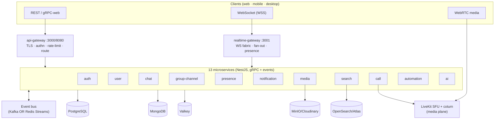
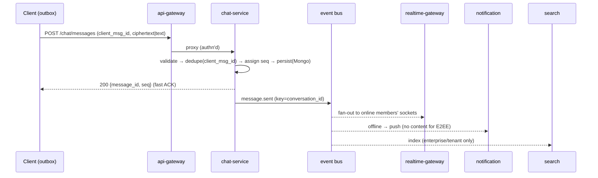
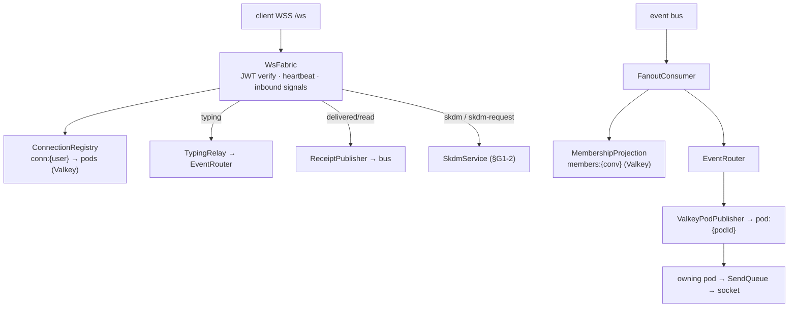

# VelChat — Codebase Guide (every service, folder & file)

> **Companion to** [`VelChat-Architecture.md`](./VelChat-Architecture.md) (the *design* source of truth).
> This document is the **map of the actual code**: what each service/folder/file is, **how** it works,
> **what it's for (kis liye)**, **why it's built that way (kyu)**, and **what's next (future)**.
> Section refs like `§B4`, `§G6` point into the architecture doc.

---

## 0. TL;DR — the whole system in one picture

VelChat is a **free / 100% open-source / self-hostable** hybrid of **WhatsApp + Microsoft Teams + Slack**:
one identity, one messaging core, three usage modes (personal E2EE · enterprise/Teams · workspace/Slack).

- **Monorepo:** pnpm workspaces + Turborepo. TypeScript everywhere.
- **13 microservices** (NestJS) + **12 shared libraries** + **raw-SQL migrations**.
- **Polyglot persistence:** PostgreSQL (relational), MongoDB (messages), Valkey/Redis (hot state),
  OpenSearch/Atlas (search), MinIO/Cloudinary (blobs).
- **Two planes:** a *data/control plane* (gRPC + events + WebSocket) and a *media plane* (WebRTC/LiveKit).
- **The sacred rule:** personal chats/calls/status/media/search/AI are **E2EE** — the server never sees
  plaintext. Enterprise channel content is **server-readable by design** (for search/compliance/bots).



---

## 1. Repository layout

```text
Velchat/
├── apps/                     # 13 deployable NestJS services (one folder each)
│   ├── api-gateway/          #  edge: TLS, authn, rate-limit, reverse-proxy routing
│   ├── realtime-gateway/     #  WebSocket fabric: fan-out, presence, typing, receipts
│   ├── auth-service/         #  DAPT auth, Reverse-OTP, tokens, device list, E2EE keys
│   ├── user-service/         #  profiles, contacts, orgs/workspaces/teams, RBAC, OPRF discovery
│   ├── chat-service/         #  messages, receipts, threads, reactions, polls, resend, extras
│   ├── group-channel-service/#  conversations, groups, channels, communities, membership
│   ├── presence-service/     #  online/last-seen/rich presence + privacy, status/stories
│   ├── notification-service/ #  push (FCM/APNs/WebPush), prefs/DND, email, bulk campaigns
│   ├── media-service/        #  upload/dedup, gallery, view-once, transcode, E2EE backup
│   ├── search-service/       #  OpenSearch indexer + query (messages/files/people/channels)
│   ├── call-service/         #  WebRTC signaling, LiveKit rooms, screen-control
│   ├── automation-service/   #  bots, slash commands, workflows, reminders, lists, clips, canvas
│   └── ai-service/           #  translation (NLLB/echo), lang prefs, cache
│
├── libs/                     # 12 shared libraries (published as @velchat/*)
│   ├── common/               #  errors, event envelope, idempotency, Nest bootstrap, tenant, obs
│   ├── config/               #  zod-validated env schema (one source for all config)
│   ├── shared-types/         #  event payload contracts + EventPayloads map
│   ├── proto/                #  gRPC .proto contracts (buf) — internal RPC source of truth
│   ├── database/             #  Postgres + Mongo clients + Drizzle entity schemas
│   ├── cache/                #  Valkey client + shared RateLimiter
│   ├── event-bus/            #  broker-agnostic bus (Kafka OR Redis Streams adapters)
│   ├── crypto/               #  OPRF (RSA blind signature) for private contact discovery
│   ├── storage/              #  object storage port (Cloudinary / S3-MinIO adapters)
│   ├── mail/                 #  SMTP mailer + branded email templates
│   ├── push/                 #  push senders (FCM v1 / WebPush / composite / log)
│   └── search/               #  search index port (Atlas Search / OpenSearch adapters)
│
├── migrations/               # raw-SQL migrations 0001..0021 (expand/contract), tsx runner
├── deploy/ · infra/ · docker/#  Helm/ArgoCD/K8s, terraform/observability, Dockerfiles
├── postman/                  #  Postman collection covering every endpoint
├── scripts/                  #  env/integration check + smoke-test scripts
├── docs/                     #  architecture, this guide, API-ENDPOINTS, integrations, audits
├── .changeset/               #  Changesets (per-package versioning → tags + GitHub Releases)
├── render.yaml               #  Render deployment (env wiring for all services)
└── turbo.json · pnpm-workspace.yaml · tsconfig.base.json · commitlint.config.cjs
```

**Why a monorepo?** One `pnpm install`, one type system, atomic cross-service refactors, shared libs
without publishing to a registry, and Turborepo caching so only changed packages rebuild/test.

---

## 2. The conventions every file follows

| Concern | Rule | Where enforced |
|--------|------|----------------|
| **IDs** | UUIDv7/ULID (time-sortable), never phone number | `libs/common/ids.ts` |
| **Time** | server UTC; clients never trusted for ordering | per-conversation `seq` |
| **Response shape** | `{success, statusCode, message, data}` / errors add `error.code, path, timestamp` | `libs/common/nest/response.interceptor.ts`, `all-exceptions.filter.ts` |
| **Errors** | typed `AppError` subclasses carry `code` + `httpStatus` | `libs/common/errors/errors.ts` |
| **Events** | standard envelope `{event_type, schema_version, event_id, occurred_at, tenant_id, producer, trace_id, payload}` | `libs/common/eventing/event-envelope.ts` |
| **Idempotency** | `client_msg_id` on writes, `event_id` dedupe on consumers | `libs/common/eventing/idempotency.ts` |
| **Tenant isolation** | fail-closed tenant context (§G6) | `libs/common/tenant/*`, `nest/tenant.interceptor.ts` |
| **Module wiring** | `XModule.forRoot(deps)` returns `{module, controllers, providers}` | every `*.module.ts` |
| **Repos** | raw parameterized `pg.pool.query` / `mongo.db.collection` | every `*.repository.ts` |
| **E2EE boundary** | no server path sees personal plaintext | reviewed per PR (§D4) |
| **Commits** | Conventional Commits, lowercase subject, body ≤100 cols | commitlint + husky |
| **Versioning** | Changesets per-package → tags + GitHub Releases | `.changeset/`, CI |

Every service folder has the **same skeleton**: `main.ts` (bootstrap), `app.module.ts` (DI wiring),
`telemetry.ts` (OTel), then one folder per feature with the `controller / service / repository /
events / dto / module` sextet. Learn it once, read all 13.

---

## 3. Architecture graphs

### 3.1 Send-a-message hot path (§B4.2) — server does the minimum, then emits



### 3.2 Event flow (who produces / who consumes)

```mermaid
flowchart LR
  chat -->|message.sent/edited/deleted| RT[realtime-gateway]
  chat -->|message.sent| search
  chat -->|mention.created| notif[notification]
  gc[group-channel] -->|conversation.created / channel.member.* / channel.updated| RT
  gc -->|conversation.created / channel.updated| search
  gc -->|group.epoch.changed| RT
  media -->|file.uploaded / file.transcoded / file.deleted| search
  media -->|file.transcoded| chat
  presence -->|presence.changed / status.posted| RT
  user -->|user.created / member.added| search
  call -->|call.started / call.control.*| notif
  RT -->|message.delivered / message.read| chat
```

### 3.3 Realtime fabric internals (§B9) — realtime-gateway



---

## 4. Shared libraries (`libs/*`)

These are the spine. A change here ripples to every service, so they carry the strongest contracts + tests.

### 4.1 `@velchat/common` — the platform kernel
**What:** cross-cutting primitives every service imports.
**Why:** one implementation of errors/logging/tracing/tenant/idempotency so services stay thin and consistent.

| File | Responsibility |
|------|----------------|
| `errors/errors.ts` | `AppError` hierarchy: `ValidationError(400)`, `Unauthorized(401)`, `Forbidden(403)`, `NotFound(404)`, `Conflict(409)`, `Gone(410)`, `RateLimit(429)`, `TenantContextMissing`, `CrossTenantAccess`. Each carries a stable `code` + `httpStatus`. |
| `eventing/event-envelope.ts` | `buildEnvelope()` — the standard event wrapper (version, id, tenant, trace, producer) for FULL_TRANSITIVE evolution (§G7). |
| `eventing/idempotency.ts` | processed-key/offset dedupe so re-delivered events are harmless (§A2.5). |
| `eventing/kafka-client.ts`, `kafka-consumer.base.ts` | Kafka producer/consumer plumbing (cooperative-sticky, DLQ hooks). |
| `ids.ts` | `uuidv7()` / ULID helpers — time-sortable, shard-friendly IDs. |
| `nest/bootstrap.ts` | `bootstrapService()` — starts Nest, global pipes/filters/interceptors, CORS (all but the proxy gateway), a pre-listen `configure` hook. |
| `nest/all-exceptions.filter.ts` | maps any thrown error → the canonical error envelope using `httpStatus`. |
| `nest/response.interceptor.ts` | wraps handler returns in `{success, statusCode, message, data}`. |
| `nest/tenant.interceptor.ts` | establishes fail-closed tenant context (ALS) per request (§G6). |
| `nest/infra-lifecycle.ts` | `ManagedResource` orchestration — ordered connect/dispose + readiness gate. |
| `nest/observability.module.ts` | `/health`, `/ready`, `/metrics`, OTel wiring. |
| `observability/{logger,metrics,tracer}.ts` | pino structured logs (no PII), Prometheus RED metrics, OTel traces. |
| `tenant/{tenant-context,authz}.ts` | AsyncLocalStorage tenant store + authorization helpers. |

**Future:** RLS GUC setter helper (§G6-1), upcaster registry for event replay (§G7-4).

### 4.2 `@velchat/config` — one env schema
**What:** a single **zod** schema (`index.ts`) validating every env var at boot; typed `AppConfig`.
**Why/kyu:** fail fast on misconfig; no scattered `process.env` reads. Includes DB URLs, `EVENT_BUS` selector,
CORS origins, mail/SMTP, FCM/VAPID, LiveKit, Reverse-OTP DID, AI translate URL, etc.
**Future:** feature-flag block; per-tenant overrides.

### 4.3 `@velchat/shared-types` — event contracts
**What:** every event payload interface + the `EventPayloads` map (topic → payload type) for end-to-end
type-safe producers/consumers. **Why:** the wire contract lives in one place; additive-only changes keep
FULL_TRANSITIVE compatibility (§G7). Recent additions: `ChannelUpdatedPayload`, `FileDeletedPayload`,
optional `name/visibility` on `ConversationCreatedPayload`.

### 4.4 `@velchat/proto` — gRPC contracts
**What:** `.proto` files (buf-generated) — the source of truth for **synchronous** inter-service RPC.
**Why:** proto is the contract; change proto first, regenerate, then implement (`.claude/rules/backend.md`).

### 4.5 `@velchat/database` — clients + schemas
| File | Responsibility |
|------|----------------|
| `postgres.client.ts` | pooled `pg` client (`ManagedResource`); repos use `pg.pool.query`. |
| `mongo.client.ts` | Mongo client + `get db()` accessor (throws until connected) — removes duplicate guards across chat repos. |
| `entities/*.schema.ts` | Drizzle table definitions centralised here (auth, ai, automation, call, collab, mail-campaign, notification, oprf). |

**Why centralize schemas?** one place to see the relational shape; migrations (raw SQL) remain the runtime
source of truth, Drizzle schemas document + type them. **Future:** generate RLS policies from schemas.

### 4.6 `@velchat/cache` — Valkey + rate limiting
`valkey.client.ts` (ioredis wrapper, `ManagedResource`) + `rate-limiter.ts` (token/fixed-window limiter,
extracted from auth so every service shares it). **Why:** presence, seq, unread, OTP, rate-limit all need sub-ms KV.

### 4.7 `@velchat/event-bus` — broker-agnostic eventing
**What:** `event-bus.port.ts` interface with two adapters — `adapters/kafka.bus.ts` (scale) and
`adapters/redis-streams.bus.ts` (₹0 MVP). `create-event-bus.ts` picks one from `config.EVENT_BUS`.
**Why/kyu:** §A3.4 — Kafka or NATS/Redis are both valid; the event catalog is broker-agnostic, so code
depends on the port, not the broker. **Future:** NATS JetStream adapter; MirrorMaker for multi-region.

### 4.8 `@velchat/crypto` — OPRF (private contact discovery, §G2)
`oprf/{bignum,hash,keys,rsa-oprf}.ts` — an RSA blind-signature OPRF so a client can check "is this phone a
VelChat user?" **without** the server seeing the number and **without** offline enumeration (every lookup
needs a rate-limitable server round-trip). **Why:** plain hashed-number discovery is brute-forceable (§G2-1).

### 4.9 `@velchat/storage` — object storage port
`storage.port.ts` (put/getSignedUrl/delete/exists) + `adapters/cloudinary.storage.ts` (₹0 default) &
`adapters/s3.storage.ts` (MinIO/S3). `create-storage.ts` selects by config. **Why:** media-service depends on
the port; swap MinIO↔Cloudinary without touching business logic.

### 4.10 `@velchat/mail` — SMTP + branded templates
`mailer.port.ts` + `smtp.mailer.ts` (nodemailer) / `log.mailer.ts` (dev). `templates/layout.ts` +
`templates/index.ts` render the **branded, spam-lean** email (circular logo, "VelChat" sender, footer with
website/LinkedIn + support). **Why:** OTP/magic-link/digests/campaigns all go through one mailer.

### 4.11 `@velchat/push` — mobile/web push
`push.port.ts` + `adapters/{fcm,webpush,log,composite}.sender.ts`, `fcm-token.ts` (FCM HTTP v1 via
service-account token). **Why:** APNs/FCM/WebPush are the only way to wake a backgrounded app (§A3.5); the
`composite` sender routes per platform. E2EE payloads carry **no content** (§A19).

### 4.12 `@velchat/search` — search index port
`search.port.ts` + `adapters/atlas-search.index.ts` (₹0) / `adapters/opensearch.index.ts` (scale) +
`opensearch.client.ts`. **Why:** §G6-3 — the tenant filter is injected **server-side inside the adapter** so
no query can bypass it.

---

## 5. The 13 services

Each subsection: **responsibility · folder tree · per-file one-liner · events · stores · future.**

### 5.1 `api-gateway` (:3000 / dev :8080)
**Kya/what:** the single edge entry. TLS, JWT verify, rate-limit, and **reverse-proxy routing** to the right
service. No business logic (§A12.1). **Web/mobile/iOS:** every client talks here (or to realtime-gw for WS).

```text
gateway/routes.ts       ordered first-match regex table → upstream (UPSTREAM_<SVC> env or localhost port)
gateway/proxy.ts        http-proxy middleware; forwards headers; 502 on upstream error
gateway/rate-limit.ts   in-memory per-IP fixed-window limiter (Valkey token-bucket in prod)
main.ts                 passes configure:(app)=>{ app.use(rateLimit); app.use(proxy) }
app.module.ts           edge module (obs, tenant); no CORS here (it pipes upstream CORS)
```
**Why regex table:** a few prefixes are shared (`/users/*` split user↔chat; `/conversations/*` split
group-channel↔chat), so ordered rules resolve overlaps deterministically. **Future:** WAF rules, gRPC-web
translation, per-route auth scopes.

### 5.2 `realtime-gateway` (:3001) — the "instant" tier (§B9)
**Kya:** holds millions of WebSocket connections, delivers events to online devices, receives client signals.

```text
fabric/ws-fabric.ts           WSS lifecycle: JWT verify → register → heartbeat → inbound signals → drain
fabric/connection-registry.ts conn:{user} → {pod,conn,device} in Valkey (TTL, heartbeat-refreshed)
fabric/event-router.ts        route(users, frame) / routeToDevice — look up pods, publish per recipient
fabric/send-queue.ts          per-conn bounded queue; drops EPHEMERAL under backpressure, never durable
fanout/fanout-consumer.ts     consume message.*/presence.*/call.* → resolve members → route to sockets
fanout/membership-projection.ts members:{conv} Valkey set, fed by conversation.created/channel.member.*
fanout/valkey-pod-publisher.ts publish to pod:{podId} pub/sub channel (cross-pod delivery)
fanout/receipt-publisher.ts   inbound delivered/read acks → durable message.delivered/read events (§B4.4)
fanout/skdm-store.ts + skdm.service.ts  Sender-Key distribution relay + offline queue (§G1-2)
fanout/typing-relay.ts        ephemeral typing.started/stopped fan-out to other members (§C4)
```
**Why split from api-gateway:** socket count (memory), not RPS, drives scale — different axis (§A8).
**Reliability:** durable messages are never dropped (re-synced by cursor §G4); only typing/presence coalesce.
**Future:** cells + resume tokens + admission control (§G3), presence aggregation tier.

### 5.3 `auth-service` (:3002) — DAPT identity (§A14.1 / §B2)
**Kya:** identity = immutable `account_id`; phone/email are re-verifiable attributes. ₹0 cold start via
Reverse-OTP; device-key/passkey loop makes verification once-per-user.

```text
auth/auth.{controller,service,repository,events,module}.ts  signup/login orchestration + auth.* events
auth/dapt/device-key.service.ts     known device signs a server nonce (FREE, biometric-gated)
auth/dapt/passkey.service.ts        WebAuthn/FIDO2 (phishing-proof)
auth/dapt/approve-device.service.ts new device approved by a trusted device (QR + signed token)
auth/dapt/magic-link.service.ts     email magic-link / OTP (self-hosted SMTP)
auth/reverse-otp/reverse-otp.{service,store}.ts  user-initiated missed-call/SMS to our DID (₹0), anti-spoof
auth/tokens/{token.service,keys}.ts RS256 access (~15m) + rotating refresh w/ reuse-detection + DPoP binding
auth/devices/device-list.{service,repository}.ts  versioned device list (epoch); revoke
auth/devices/key-transparency.ts    append-only log so clients audit device-list consistency (§G1-3)
auth/recovery/{recovery.service,backup-codes}.ts  multi-factor + delay + notify-all (§B2.7)
```
**Why:** closes SIM-swap, recycled-number, Sybil, token-theft (§D4) while staying ₹0. **Future:** Keycloak
SSO/SCIM wiring, Play Integrity/App Attest verification service, PQXDH last-resort prekey.

### 5.4 `user-service` (:3003) — directory & tenancy (§B3)
```text
directory/  profiles, contacts (hashed), blocking, contact.added events
tenancy/    organizations/workspaces/teams, memberships, RBAC, org.created/member.added events
discovery/  OPRF contact discovery (blind→evaluate→unblind), key rotation (§G2)
admin/      admin console APIs (members/roles/retention/audit)
```
**Why:** one owner for identity-adjacent relational data; consumer people-discovery is phone-hash based,
enterprise is org-directory + invite. **Future:** profile module emitting `user.updated` (enriches people
search names), SCIM provisioning, DLP hooks.

### 5.5 `chat-service` (:3004) — the messaging core (§B4)
```text
chat/chat.{service,repository,controller,events}.ts  send hot path, history paging, message.* events
chat/seq.service.ts        atomic per-conversation seq (Valkey) → total order without wall-clock
chat/receipts.{consumer,repository}.ts  delivered/read fan-in → sender receipts (privacy-aware)
chat/message.types.ts      the Mongo message document shape (§B4.1)
polls/                     single/multi/anonymous polls + live tallies (§B16)
resend/                    E2EE decryption-failure resend protocol (§G1-1, near-zero permanent loss)
extras/                    pin/star/archive/mute/notes-to-self + conversation state (§A4.1)
```
**Why Mongo:** append-heavy, flexible message schema, shard by `conversation_id`. **Store:** MongoDB (messages)
+ Valkey (seq, recent cache, unread). **Future:** plaintext body indexing for enterprise convs, scheduled/
disappearing TTL workers, edit-history compliance export.

### 5.6 `group-channel-service` (:3005) — conversations & membership (§B7)
```text
channels/channels.repository.ts  conversations + conversation_members + communities (Postgres)
channels/channels.service.ts     DM (dedup id), group (≤1024), channel (public/private/announcement),
                                 join/leave, roles, per-member notif level, communities + epoch rotation
channels/dm-id.ts                deterministic DM id from the sorted member pair (create-once)
channels/channels.events.ts      conversation.created / channel.member.* / channel.updated / group.epoch.changed
channels/conversation.types.ts   MemberRole, MAX_GROUP_MEMBERS, NewConversation
```
**Why split from chat:** membership/admin CRUD scales differently than the message hot path (§A8).
**Store:** Postgres. **Future:** broadcast lists, shared/connect channels, guest scoping.

### 5.7 `presence-service` (:3006) — presence, last-seen privacy, status (§B8)
```text
presence/presence-state.ts   pure resolve(call/manual/idle/online) + canSee() last-seen/online privacy
presence/presence.service.ts online/offline/heartbeat, get(viewer?)-with-privacy, setPrivacy, subscribe
presence/presence.repository.ts  online:{u}/lastseen:{u}/pstatus:{u}/subscribers:{u}/privacy:{u} (Valkey)
status/                      status/stories: text/image/video/voice, audiences, views, reactions, TTL (§B8)
```
**Why:** presence write-rate (typing/heartbeat) dwarfs everything → isolated so it can't poison other SLOs.
Fan-out only to `subscribers:{u}` (on-screen), never all N contacts (§A15.2). **WhatsApp privacy:**
`everyone|contacts|nobody` with the reciprocity rule (hide yours → can't see others'). **Future:** calendar/
call-state feeding rich presence, presence aggregation tier for flash crowds.

### 5.8 `notification-service` (:3007) — push, prefs, campaigns (§B10)
```text
notify/notification.consumer.ts  message.sent/mention/call.* → resolve recipients → route
notify/notify-policy.ts          apply level/mute/DND/keywords/mention-only (pure, testable)
notify/members.projection.ts     event-sourced membership for routing (no cross-service DB read)
notify/outbox.worker.ts          durable outbox + retry/backoff/DLQ (push is a hint, not truth §G4)
campaigns/campaign.{service,worker}.ts + recurrence.ts  bulk + scheduled + recurring mail campaigns
```
**Why:** push transports are unreliable → correctness comes from cursor sync, push is best-effort; E2EE
payloads carry no content. **Store:** Postgres (prefs/endpoints) + Valkey (unread). **Future:** VoIP push for
CallKit, email digest scheduler, badge reconciliation from server truth.

### 5.9 `media-service` (:3008) — media pipeline & backup (§B11/§A16/§C22)
```text
media/media.service.ts       init → content-hash dedup → put → ready → file.uploaded; gallery; delete
                             (refcount GC); view-once consume (§C22 replay-proof 410); transcode write-back
media/media.repository.ts    media_objects metadata; claimViewOnce (atomic single-view); refcount by hash
media/media.events.ts        file.uploaded / file.transcoded / file.deleted
media/media.types.ts         MediaObject, Renditions, TranscodeResult, content-addressed key
backup/                      E2EE chat backup blob store (server stores only ciphertext, §C21)
```
**Why content-addressing:** the same file forwarded many times stores once; personal media is ciphertext and
never transcoded (E2EE boundary). **Store:** MinIO/Cloudinary (blobs) + Postgres (metadata). **Future:**
resumable multipart, ClamAV scan step, ffmpeg/HLS worker calling `PATCH /media/:id/renditions`.

### 5.10 `search-service` (:3009) — index & query (§A18/§B13)
```text
search/search.consumer.ts  builds indexes from events (message.sent, file.uploaded/deleted,
                           conversation.created, channel.updated, member.added, user.created)
search/search.service.ts   query messages/files/channels/people + suggest; ACL-filtered server-side
search/search-query.ts     parse from:/in:/has:/before:/after: + allowedHit ACL + matchesFilters (pure)
```
**Why:** built **purely from the event stream** (§A10.5); personal E2EE never indexed server-side (on-device
only §A18.2). Channel ACL = public-or-member; files reuse conversation ACL; people are tenant-scoped.
**Store:** OpenSearch/Atlas. **Future:** semantic k-NN re-rank, plaintext body indexing, index-per-tenant.

### 5.11 `call-service` (:3010) — WebRTC signaling & meetings (§B12)
```text
calls/calls.service.ts    create/join room, LiveKit scoped token, lobby, recording flags; call.* events
calls/livekit-token.ts    mints scoped LiveKit access tokens (SFU join)
screen-control/           Teams-style remote screen control: request→grant→control→revoke state machine
screen-control/screen-control.logic.ts  pure canTransition/isTerminal (call.control.* events)
```
**Why:** signaling is bursty + tied to the media plane, so it's isolated; media never touches the event bus.
**Store:** Postgres (meeting meta) + Valkey (room state). **Future:** LiveKit Egress recording, Whisper live
captions, breakout rooms, huddles.

### 5.12 `automation-service` (:3011) — bots, workflows, collab (§B17/§A4.7)
```text
automation/automation.service.ts  bots, slash commands, interactive components, webhooks (HMAC-signed)
automation/job.worker.ts + backoff.ts + hmac.ts  durable job runner (retries), signed delivery
lists/                    Slack-style structured task/tracking lists in a channel
collab/                   clips (short async audio/video) + canvases (collaborative docs)
```
**Why:** webhook/job volume is its own scaling axis; workflows must run durably with retries. **Store:**
Postgres + Valkey (jobs). **Future:** no-code workflow builder UI contract, approvals/forms, app directory.

### 5.13 `ai-service` (:3012) — translation & intelligence (§A25/§A26/§B20)
```text
translate/translate.service.ts   detect → translate → cache; enterprise server-side only
translate/adapters/http-translate.provider.ts  calls a self-hosted NLLB/Marian endpoint
translate/adapters/echo-translate.provider.ts  dev fallback (no model)
translate/translation-cache.ts   xlate:{sha(text)}:{src}:{tgt} → repeat views are free
translate/lang.repository.ts      per-user language + per-chat translate prefs
```
**Why:** the **privacy fork** — personal E2EE translation runs **on-device**; enterprise runs here (already
server-readable). Models are self-hosted (₹0). **Future:** Whisper live-caption pipeline, summaries via
vLLM/Ollama, semantic embeddings, moderation classifiers (enterprise only).

---

## 6. Data & migrations

**Raw SQL migrations** (`migrations/src/sql/0001..0021`, run by `tsx src/migrate.ts up`) are the runtime
source of truth; **expand/contract** only (safe on rolling deploys). Highlights:

| Files | Adds |
|-------|------|
| 0001 auth · 0002 tenant_rls_reference | accounts/identifiers/devices/tokens; RLS reference policy (§G6) |
| 0003 conversations · 0004 device_list_keytransparency · 0005 sender_key_epoch | conversations/members/communities; versioned device list + KT log (§G1-3); group epoch (§G1-2) |
| 0006 media · 0007 status · 0008 backups | media_objects; status/stories; E2EE backup blobs |
| 0009 tenancy · 0010 directory · 0011 admin | orgs/workspaces/teams/memberships; profiles/contacts; admin/audit |
| 0012 calls · 0013 notifications | calls/participants/meetings; notification prefs/endpoints |
| 0014 mail_campaigns · 0015 ai_language · 0016 automation · 0017 oprf_discovery | bulk mail; language prefs; bots/workflows/jobs; OPRF tokens (§G2) |
| 0018 lists · 0019 screen_control · 0020 clips_canvas · 0021 media_view_once | Slack lists; Teams screen-control; clips/canvas; **view-once `viewed_at` + gallery index** |

**Polyglot stores** (§A10): Postgres (relational/RBAC), Mongo (messages), Valkey (hot/ephemeral),
OpenSearch/Atlas (search), MinIO/Cloudinary (blobs). One service owns each store; others read via gRPC or an
event-sourced projection — **never** cross-service DB access.

---

## 7. Cross-cutting: versioning, testing, deploy

- **Versioning — Changesets** (per-package). `pnpm changeset` before pushing a change; merging the auto
  "Version Packages" PR cuts git **tags + GitHub Releases + CHANGELOG** (two-step flow). `@semantic-release/npm`
  is intentionally **not** used.
- **Commits:** Conventional Commits enforced by commitlint + husky (pre-commit lint/format, commit-msg,
  pre-push changeset reminder). Subjects lowercase; body lines ≤100 cols; scope from the enum.
- **Testing:** per-service Jest — unit (pure logic like `presence-state`, `search-query`, `notify-policy`,
  `screen-control.logic`), service tests with faked repos/index/storage, `test/security/*` (one per §D4 row),
  `test/unit/health`. Integration via testcontainers where wired. Run `pnpm -w build` for the full type gate.
- **Deploy:** `render.yaml` wires env for all services (MVP); `deploy/` holds Helm/ArgoCD/K8s for scale;
  `docker/` the Dockerfiles. GitOps + canary is the target (§A22).
- **API surface:** [`docs/API-ENDPOINTS.md`](./API-ENDPOINTS.md) + the Postman collection cover every route;
  the gateway routing table (`apps/api-gateway/src/gateway/routes.ts`) is the authoritative path→service map.

---

## 8. How to run / develop

```bash
pnpm install                       # one install for the whole monorepo
pnpm --filter @velchat/migrations migrate   # apply pending SQL migrations
pnpm -w build                      # type-check + build every package (Turbo-cached)
pnpm --filter @velchat/<svc> test  # test one service
./start-all.ps1                    # boot all services + gateway locally (Windows)
```
**Add a feature to a service:** touch `.proto`/events first if the contract changes → add the
`controller/service/repository/events/dto` set → wire in `app.module.ts` → unit-test the pure logic → run
the service build+test → `pnpm changeset` → commit (Conventional) → PR `dev → main`.

**Golden rules while editing (never cross):** no paid SaaS in the critical path · never leak personal
plaintext to the server · never key data on phone number · no secrets in code/images · never break a
published contract without a versioned (additive) migration.

---

*This guide tracks the code as of migrations 0001–0021 and the 13-service / 12-lib layout. Keep it in sync
when a service gains a folder or a new event — it is the human map that complements the machine contracts.*
